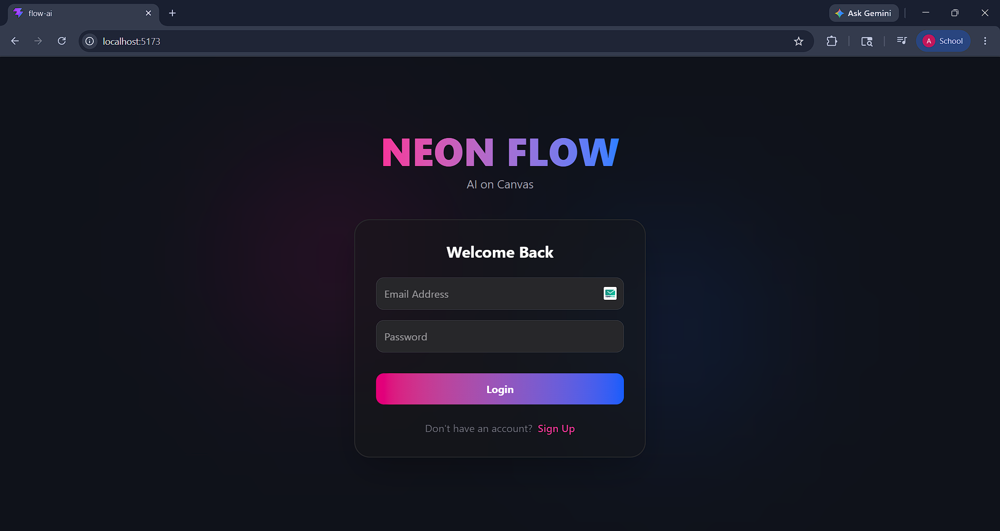
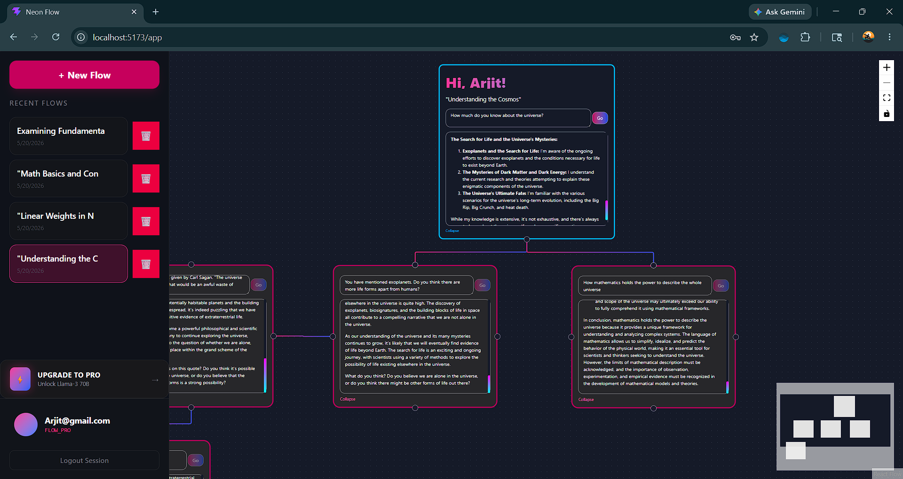

# Neon Flow: The Infinite Canvas AI Experience

### **Transforming Linear Chat into Spatial Intelligence**

---

## Product Overview
**Neon Flow** is a state-of-the-art AI productivity platform that replaces the traditional "message bubble" interface with an **infinite, node-based canvas**. By treating conversations as visual flows rather than vertical lists, Neon Flow allows users to map out complex ideas, branch into new topics without losing context, and manage multi-layered AI interactions in a single visual space.

Built for researchers, developers, and creative thinkers, it provides a high-performance environment where every AI response is a "node" that can be connected, moved, and saved as part of a larger mental map.

---

## The Problem: The "Vertical Scroll" Fatigue
Traditional AI interfaces (ChatGPT, Claude, etc.) suffer from **Linear Limitation**. As a conversation grows, several problems emerge:
*   **Scrolling Fatigue**: Crucial information becomes buried under 50+ messages, requiring constant scrolling to find context.
*   **Context Loss**: When a user wants to ask a "what if" question about a previous point, they have to break the current flow or start a new chat entirely.
*   **Cognitive Load**: Humans think spatially and multi-dimensionally, but traditional chatbots force thoughts into a narrow, vertical "text-message" box.

### **The Solution: Spatial Conversation**
Neon Flow solves this by introducing **Spatial Context**. Instead of scrolling, you **pan**. Instead of starting over, you **branch**. 

*   **Branching Conversations**: Create multiple "Chat Nodes" from a single prompt to explore different outcomes simultaneously.
*   **Visual Persistence**: Keep important definitions or code blocks visible on one side of the canvas while you continue the conversation on the other.
*   **Infinite Workspaces**: Each "Flow" is a persistent document saved in the cloud, ready to be picked up exactly where you left it.

---


## Tech Stack
*   **Frontend**: React.js with **React Flow** for the infinite canvas engine.
*   **Styling**: Tailwind CSS for a high-performance, dark-mode "Neon" aesthetic.
*   **Backend**: Node.js & Express.js.
*   **Database**: MongoDB (NoSQL) for flexible storage of complex node/edge relationships.
*   **AI Engine**: Gemini-3-Flash-Preview.
*   **Security**: JWT (JSON Web Tokens) for session-based authentication.

---

## Running the Product

### **1. Prerequisites**
*   Node.js (v18+)
*   MongoDB Atlas Account
*   Gemini API Key

### **2. Environment Configuration (Folder: server)**
Create a `.env` file in the root directory:
```text
GEMINI_API_KEY=Your-api-key
PORT=4000
MONGODB_URI=mongo-db-uri
JWT_SECRET=a_long_random_string_for_security
```


### **3. Installation**
```bash
# Install backend dependencies
cd server
npm install

# Install frontend dependencies
cd ../client
npm install
```

### **4. Launch**
```bash
# Start Backend
cd server
npm run dev

# Start Frontend. Make sure you are at the root.
cd client
npm run dev
```
Open `http://localhost:5173` to experience Neon Flow.

---

## Images
Landing Page


Workspace


**#stopscrollingstartflowing.**

---
## Conclusion
Neon Flow is more than a tool; it is a shift in how we interact with artificial intelligence. By removing the constraints of the vertical scroll and embracing the infinite canvas, we have created an environment that mirrors the way the human brain actually works—messy, branching, and visual. 

**Neon Flow: Stop scrolling. Start flowing.**

---

*Launching soon*
## Author
This is the work of *Arjit Prakher*, a student of **Master of Computer Application**
